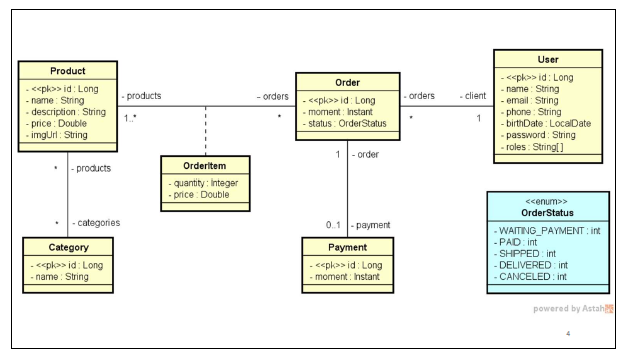

# Sobre o desafio

Deve-se entregar o projeto DSCommerce estruturado e com todas as funcionalidades implementadas conforme as aulas. O projeto deve ser implementado com Java e Spring Boot, usando banco de dados H2, conforme aulas.

## Modelo conceitual



## Critérios de correção

1. Mínimo 12 commits no projeto no usuário do aluno (eliminatório)
2. Endpoints públicos GET /products e GET /products/{id} funcionam sem necessidade de login (eliminatório)
3. Endpoint de login funcionando e retornando o token de acesso (eliminatório)
4. Endpoints privados de produto (POST/PUT/DELETE) funcionam somente para usuário ADMIN (eliminatório)
5. Endpoint GET /users/me retorna usuário logado (eliminatório)
6. Endpoints GET /orders/{id} e POST /orders funcionando (eliminatório)
7. Usuário que não é ADMIN não consegue acessar pedido que não é dele em GET /orders/{id} (eliminatório)
8. Endpoint GET /categories retorna todas categorias

## Créditos

Este desafio faz parte do curso **Java Spring Professional** da **Devsuperior**, ministrado pelo Prof. Dr. **Nélio Alves**, que visa trabalhar:

- Estruturação de projeto Spring Boot de API Rest
- Implementação de Authorization Server com password grant em projeto Spring Boot
- Implementação de Resource Server em projeto Spring Boot
- Controle de acesso por perfil de usuário em nível de rota
- Controle de acesso em nível de regra de negócio
- Realização de casos de uso

## Como executar o desafio

*Pré-requisitos*:

- Tecnologias: 
  - Java 21 
  - Maven 3
- Programas:
    - Terminal → para clonar e executar o projeto
      - ex.: Git Bash, Windows PowerShell, Prompt de comandos do Windows
    - (opcional) IDE ou editor de texto
      - ex.: Intellij IDEA, VS Code
    - Navegador web → para checar seeding da base de dados com H2
    - Postman → para testar as requisições de recursos

---

Abra um terminal de sua preferência, como o Git Bash, e execute os comandos a seguir:

````
# clonar repositório (via HTTPS)
git clone https://github.com/jonatasmateus/dscommerce

# entrar na pasta do desafio
cd dscommerce

# executar o projeto
./mvnw spring-boot:run
````

---

Caso tenha e opte por usar alguma IDE ou editor de texto instalado, certifique-se de ter o projeto clonado e execute o projeto dentro da IDE ou editor de texto.

### Para checar o seeding da base de dados

Abra um navegador web de sua preferência, digite a seguinte URL `http://localhost:8080/h2-console/`, logue o banco H2 conforme as especificações do arquivo application-test.properties para checar o seeding dos dados.

## Autor

Jonatas Mateus Souza

LinkedIn: www.linkedin.com/in/jonatasmateus 